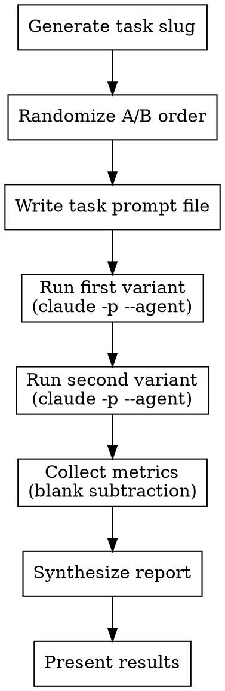

# Full A/B Test Mode (Revised)

Run both variants as separate `claude -p --agent` processes in randomized order, collect metrics, synthesize comparison report.



## Step 1: Generate Task Slug

Create a 2-4 word kebab-case slug from the task description. Today's date: `YYYY-MM-DD` format. All file paths are relative to the project root.

## Step 2: Dispatch Variants (Sequential, Randomized Order)

Randomize whether A or B runs first to eliminate ordering bias.

| Variant | `--agent` value |
|---------|-----------------|
| A | `testA-main` |
| B | `testB-main` |

### 2a: Write Task Prompt File (Per Variant)

Write the prompt file **before each variant run** (not once for both). The prompt includes a variant-specific efficiency preamble followed by the task description.

**For variant A (native tools):**

```bash
cat > /tmp/ab-task-prompt.txt << 'TASK_EOF'
## Efficiency Guidelines

- **Batch searches:** When looking for multiple things, combine into fewer tool calls. Use `Grep` with broader patterns rather than one call per keyword.
- **Parallel calls:** Make independent tool calls in the same message — don't serialize calls that have no dependency.
- **Glob before Grep:** Use `Glob` to narrow the file set, then `Grep` only the relevant paths.
- **Avoid redundant reads:** If a tool result already gave you the information, don't re-read the same file.

---

<full task description here>
TASK_EOF
```

**For variant B (jcodemunch):**

```bash
cat > /tmp/ab-task-prompt.txt << 'TASK_EOF'
## Efficiency Guidelines

- **Batch searches:** Combine related lookups into fewer tool calls. Use `search_symbols` with broader queries rather than one call per symbol.
- **Parallel calls:** Make independent tool calls in the same message — don't serialize calls that have no dependency.
- **Use `detail_level: "compact"`** on `search_symbols` when you only need names and paths (not full signatures/docs). This returns ~15 tokens/result vs ~75 at standard.
- **Set `token_budget`** on search calls to cap response size when you expect many results.
- **Prefer `get_file_outline`** over `get_file_content` when you only need to know what's defined in a file, not read every line.
- **Avoid redundant reads:** If a tool result already gave you the information, don't re-read the same file.

---

<full task description here>
TASK_EOF
```

### 2b: Run Each Variant

**For each variant (in randomized order), write the prompt file per 2a for that variant, then:**

1. Run:
   ```bash
   claude -p --agent {testA-main|testB-main} --output-format json < /tmp/ab-task-prompt.txt > /tmp/ab-variant-{A|B}.json
   ```
   Use Bash `timeout` of 600000ms (10 min max). If the task is expected to exceed this, use `run_in_background` and poll with `TaskOutput`.
2. Read the result JSON file and extract metrics.

### Metrics Available from `claude -p --output-format json`

```json
{
  "total_cost_usd": 0.33,
  "duration_ms": 30000,
  "duration_api_ms": 25000,
  "num_turns": 8,
  "is_error": false,
  "result": "...",
  "session_id": "...",
  "modelUsage": {
    "<model-name>": {
      "inputTokens": 100,
      "outputTokens": 2500,
      "cacheReadInputTokens": 150000,
      "cacheCreationInputTokens": 75000,
      "costUSD": 0.33
    }
  }
}
```

Record for each variant: `total_cost_usd`, `duration_ms`, `duration_api_ms`, `num_turns`, `is_error`, `result` text, and the four `modelUsage` token fields. The `modelUsage` object is keyed by model name — use the first (typically only) key to access token fields.

## Step 3: Collect Metrics

After both variants complete:

1. Read both result JSON files
2. Compute **absolute cost difference**: `total_cost_A - total_cost_B` (negative = A cheaper). Primary metric — immune to overhead because additive overhead cancels in subtraction.
3. Compute **gross ratio**: `total_cost_A / total_cost_B` (below 1.0 = A cheaper). Compressed toward 1.0 by overhead but directionally correct.
4. **Attempt corrected ratio** using blank subtraction:
   ```
   overhead(N) = 0.15 + N × 0.0167
   net_cost = total_cost_usd - overhead(num_turns)
   ```
   Apply to both variants independently. Each variant may have different turn counts, producing different overhead values — this is correct and expected.
   - If both net costs > $0.01: compute `net_cost_A / net_cost_B` as corrected ratio (below 1.0 = A cheaper)
   - If either net cost <= $0.01: mark corrected ratio as "unreliable" — rely on absolute difference

### Why this hierarchy?

**Absolute difference** is the reliable primary metric: `gross_A - gross_B = net_A - net_B` because additive overhead cancels in subtraction. No calibration needed, always correct.

**Corrected ratio** is secondary — it removes overhead before division to decompress the ratio, but requires both net costs to be meaningfully positive. When cache warming reduces the second variant's cost below the overhead floor, net costs go negative and the ratio becomes nonsensical. Guard: skip if either net cost <= $0.01.

**Gross ratio** is tertiary — directionally correct but compressed toward 1.0 by overhead (`(a+c)/(b+c)` → 1 as `c` grows). See Kronmal 1993, Ritchie et al. 2007.

### Calibration data

| Metric | Per-Turn Slope | Base (intercept) | R² |
|--------|---------------|-------------------|-----|
| Cost ($) | 0.0167 | 0.15 | 0.9999 |

Source: 5-point forced-turn calibration (1, 5, 10, 15, 20 forced turns), 2026-03-22. The calibration uses the same `claude -p --agent` execution model as the A/B harness, so the overhead profile is identical.

### Recalibration

If the system context changes significantly (new MCP servers, major CLAUDE.md restructuring, model change), re-run the calibration. Signs that recalibration is needed: net cost going negative, or corrected ratio diverging wildly from gross ratio on tasks with similar turn counts.

### Note on `total_cost_usd` and Max Subscription

On a Max Subscription, `total_cost_usd` is a computed estimate of what the run would cost at API rates — not an actual charge. The absolute dollar values are informational, not financial. The efficiency ratio remains valid regardless of pricing model because both variants are priced identically.

## Step 4: Synthesize Report

Read `report-template.md` in this skill directory for the report template, then fill in all placeholders from collected metrics.

## Step 5: Present Results

After saving the report, display:
1. The report file path
2. The executive summary
3. The efficiency comparison table
