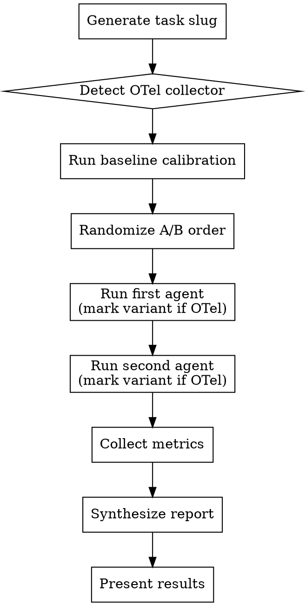

# Full A/B Test Mode (DEPRECATED)

**This mode is deprecated.** Use `/ab-test-revised` instead. Stop here and switch to `/ab-test-revised`.

---

*Historical reference below — do not execute.*

Run both variants sequentially in randomized order, collect metrics, synthesize comparison report.



## Step 1: Generate Task Slug

Create a 2-4 word kebab-case slug from the task description. Today's date: `YYYY-MM-DD` format. All file paths are relative to the project root.

## Step 2: Start OTel Token Collector

### 2a: Health check

```bash
curl -s http://localhost:4318/api/health 2>/dev/null
```

- **Responds `{"status":"ok",...}`**: Collector already running. Set `otel_available = true`.
- **Fails/times out**: Proceed to 2b.

### 2b: Auto-start collector (if health check failed)

```bash
node ~/.claude/skills/ab-test/otel-token-collector.mjs testing/data/otel-tokens.json &
```

Use Bash `run_in_background`. Wait 2 seconds, then re-check health:

```bash
sleep 2 && curl -s http://localhost:4318/api/health 2>/dev/null
```

- **Responds**: Set `otel_available = true`.
- **Still fails**: Set `otel_available = false`, warn user, continue without OTel.

### 2c: Verify session telemetry

This harness runs agents as subagents inside the current Claude Code process. OTel metrics are only emitted if the **session** was launched with telemetry env vars (`CLAUDE_CODE_ENABLE_TELEMETRY=1`, `OTEL_EXPORTER_OTLP_ENDPOINT`, etc.).

Check: `echo $CLAUDE_CODE_ENABLE_TELEMETRY`

- **Returns `1`**: Session can emit metrics. Proceed.
- **Empty/unset**: Warn user: "OTel collector is running but this session wasn't launched with telemetry env vars. Token breakdown will be empty. Restart Claude Code with the env vars from `otel-setup.md`, or continue with `total_tokens` only." Set `otel_available = false`.

## Step 3: Run Baseline Calibration

Measure fixed overhead by running a no-op `testA-baseline` agent:

```
Report ready. No search needed.
```

Record `total_tokens` from the Agent result as `baseline_tokens`.

**If `otel_available`:** Mark variant first: `curl -s -X POST http://localhost:4318/api/variant/calibration`. Query summary after: `curl -s http://localhost:4318/api/summary`.

## Step 4: Dispatch Agents (Sequential, Randomized Order)

Randomize whether A or B runs first to eliminate ordering bias (cache warming, context effects).

| Variant | `subagent_type` |
|---------|-----------------|
| A | `testA-baseline` |
| B | `testB-jcodemunch` |

**Agent configuration:**
- Use the `subagent_type` values above (NOT `general-purpose`)
- Do NOT use `isolation: "worktree"` — both agents must search the same codebase state

**Prompt:** Pass the task description directly. No metrics instructions — agents just do the task.

**For each agent (in randomized order):**
1. **If `otel_available`:** `curl -s -X POST http://localhost:4318/api/variant/{A|B}`
2. Launch agent, wait for completion
3. Record `total_tokens`, `tool_uses`, `duration_ms` from Agent result

## Step 5: Collect Metrics

After both agents complete:

1. Compute **net search tokens** for each: `total_tokens - baseline_tokens`
2. **If `otel_available`:** Query `curl -s http://localhost:4318/api/summary` for per-variant breakdown, then shut down the collector: `curl -s -X POST http://localhost:4318/api/shutdown`. This saves data to the output file and terminates the background process.
3. **Validation (OTel only):** Verify `input + output + cacheRead + cacheCreation ≈ total_tokens` (within 5%). Note discrepancies in report.

## Step 6: Synthesize Report

Read `report-template.md` in this skill directory for the report template, then fill in all placeholders from collected metrics.

## Step 7: Present Results

After saving the report, display:
1. The report file path
2. The executive summary
3. The efficiency comparison table
