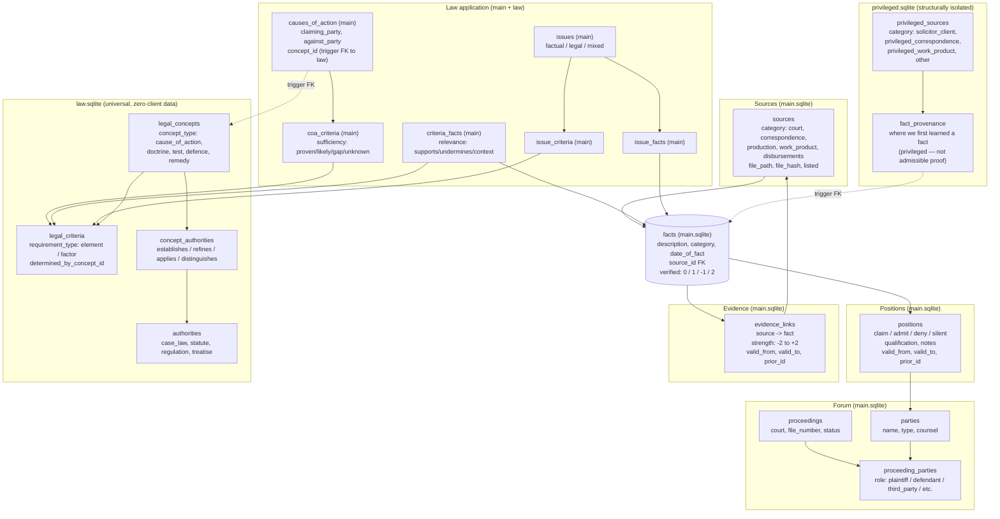

# case-data — Load-Bearing Design Decisions

This file documents decisions that look like incidental implementation choices but are load-bearing. A future developer "simplifying" or "tidying" them will break the system in ways that are hard to detect and harder to recover from. Read before modifying any file in this directory.

## Architecture at a glance

The schema has three databases and three conceptual layers. **Facts** sit at the centre: every other element either supplies a fact, proves a fact, contests a fact, or anchors a fact to legal criteria. `main.matter_metadata` makes each database self-describing if copied away from its folder. The two-track model (main vs. privileged) is the structural heart of the privilege design — see Section 1 below. Law is isolated into its own database to prevent confusion between case-law facts and case facts — see Section 10.

**How to read it.** Solid arrows are enforced referential constraints — either declared FKs (within the same database) or trigger-enforced FKs (across ATTACHed databases). Dotted arrows are trigger-enforced cross-database FKs (6 total; see `triggers.sql`). The structural firewall (Section 1) is the physical absence of any FK path from privileged.sqlite to evidence_links or positions.

**Verification metadata is universal.** Almost every table carries a `verified` column with the four-state enum `{0, 1, -1, 2}` — see Section 6 for why a binary flag is insufficient.

## 1. The two-track model is structural

`privileged_sources` and `fact_provenance` (in `privileged.sqlite`) live in a different attached database from `evidence_links` and `positions` (in `main.sqlite`). **SQLite cannot declare a foreign key across attached databases.** The firewall is not a convention — it is a syntactic impossibility. There is no `REFERENCES main.evidence_links` you can write inside `privileged.sqlite`'s schema; the parser will not allow it.

Do not merge `privileged.sqlite` into `main.sqlite` to "simplify." That move re-introduces the option of declaring a cross-track FK and demotes the firewall back to a CHECK or trigger that an INSERT can violate, that a developer can disable, or that a buggy ingestion path can route around. The physical SQLite separation is the firewall.

Evidence data (evidence_links, positions) lives in main.sqlite alongside facts. The firewall is between main and privileged — not between facts and evidence.

## 2. The dividing-line rule lives in SKILL.md, not the schema

The categorisation rule — "does this source belong in main or privileged?" — is **not** enforced by any constraint. It depends on facts the schema cannot see: client intent, whether waiver has occurred, whether privilege was asserted.

Source categories by database:
- **main.sqlite** (5): court, correspondence, production, work_product, disbursements
- **privileged.sqlite** (4): solicitor_client, privileged_correspondence, privileged_work_product, other

Soft enforcement is layered:
- SKILL.md decision rule (the ingesting agent applies)
- AI verifier sweep of `verified = 0` rows
- Lawyer review of `verified = 2` rows

Do not encode this rule as CHECK constraints or triggers — the schema would either reject legitimate edge cases or fail silently on the genuinely ambiguous ones. The schema is for invariants; SKILL.md plus the verifier backlog is for judgment.

## 3. Promoted privileged sources are never deleted

When a privileged source becomes producible, insert a new row in `main.sources` and keep the `privileged_sources` row intact. Do **not** delete or move the original row. The two-row pattern preserves the matter record across the privilege transition; deletion would erase the lineage that proves how the document came to be produced.

No `promoted_to` FK is needed — the relationship is discoverable via matching `file_hash` values across databases.

## 4. fact_provenance is not evidence_links

`fact_provenance` (privileged.sqlite) records *investigative provenance* — where we first learned a fact. `evidence_links` (main.sqlite) records *admissible proof* — what we can put before the court. These are structurally distinct concepts because privileged sources cannot prove a fact at trial; an admissible substitute must be found.

A fact appearing only in `fact_provenance` with no `evidence_links` rows is a trial-prep gap. Do not "consolidate" the two tables to remove apparent duplication — collapsing them would silently allow privileged sources to be treated as evidence.

## 5. The text dump is the migration boundary

Section markers: `-- ===== v6 BEGIN main =====`, `-- ===== v6 BEGIN law =====`, `-- ===== v6 BEGIN privileged =====`. Migrations run on `/tmp/` copies under `PRAGMA journal_mode = DELETE` (WAL breaks cross-database atomicity). There is no schema-version table; header comments in the schema file mark the version, and `main.matter_metadata` records matter identity.

Do not run migrations directly against the matter folder — copy to `/tmp`, mutate, validate, then copy out.

## 6. Verification is a three-tier model with mandatory session isolation

`verified` is a four-state enum: `0` (unverified), `1` (AI-verified), `-1` (AI-rejected), `2` (needs human judgment). The AI verifier agent **must** run in a session isolated from the agent that created the row. Same-context verification is the AI confirming its own work and provides no independent assurance against the dominant failure mode (confident-but-wrong output).

The lawyer's review queue is `verified = 2` only, not the full `verified = 0` backlog — that is the verifier's job. Do not collapse the four states back to a binary `verified` flag; doing so re-introduces the failure that the three-tier model exists to defeat.

## 7. Derived views filter `verified >= 0`, not `verified = 1`

Every derived view filters on `verified >= 0`. For views over bitemporal tables (`v_current_positions`, `v_current_evidence_links`, `v_fact_status`), the filter is `WHERE valid_to IS NULL AND verified >= 0`. Rejected rows (`-1`) are excluded; **unverified (`0`) and needs-human (`2`) rows still count.**

Two failure modes this defeats:
- Filtering on `verified = 1` would empty the views during active ingestion, because every freshly ingested row starts at `0`. The views become useless precisely when the lawyer most needs them.
- Filtering on `verified IN (0,1,2)` (equivalent to no filter) would let an AI-rejected denial silently flip a fact's posture. The verifier's "this row is wrong" judgment would be ignored at query time.

## 8. `qualification` is verbatim pleading text; `notes` is lawyer commentary

`positions.qualification` holds the **verbatim** qualifying clause from the pleading (e.g., `"admits paragraph 12 insofar as the parties entered into an agreement, but denies the characterization of its terms"`). The `position` enum stays clean (`claim | admit | deny | silent`); nuance lives in `qualification`.

The two columns are orthogonal:
- `qualification` is the document speaking. Reproduce verbatim.
- `notes` is the lawyer speaking. Annotation, strategy notes.

Do not collapse them. Do not split a qualified admission into one `admit` row and one `deny` row — qualified admissions are conceptually one response with a reservation, and splitting loses the pleading structure that determines what the responding party is bound to.

## 9. Posture derivation is view-driven, not stored

`v_fact_status` derives posture from current positions. Five values:

| Positions on a fact | Posture |
|---|---|
| Party A claims, Party B claims same | **agreed** |
| Party A claims, Party B admits | **admitted** |
| Party A claims, Party B is silent | **not_denied** |
| Party A claims, Party B denies | **disputed** |
| Party A claims, no response | **claimed** |
| No positions | **unclaimed** |

Position types are a CHECK constraint (`claim | admit | deny | silent`), not a lookup table. No `position_kind` table exists — the precedence logic from v5 is eliminated. Court findings are out of scope (by trial the case is over; appeals are out of scope).

## 10. law.sqlite isolation prevents fact confusion

Legal elements and authorities live in a separate database (`law.sqlite`) for two reasons:

1. **Prevents AI models from confusing case-law facts with case facts.** When law and case data share a database, models conflate "the court in Mustapha found X" with "in this case, X happened." Physical separation forces the model to cross an ATTACH boundary, making the distinction structural.

2. **Enables porting legal research to a new matter without leaking client PII.** `law.sqlite` contains zero client data — it can be copied to a new matter folder without redaction or review.

## 11. Deferred design memos are problem+insight, not spec

Deferred items live in `references/deferred/` as four-part memos: **Problem -> Insights -> Direction (non-binding) -> Left open**, with a "When this memo fires" trigger block.

Memos are **not specs**. The "Direction" section is non-binding and may be stale. When a trigger fires, read the memo, absorb the rationale, then design fresh against the then-current schema. Do not copy "Direction" into a plan verbatim.

Two structural rules:
- **`SKILL.md` enumerates every memo by path and trigger.** A memo added to `references/deferred/` without a corresponding row in SKILL.md will never fire.
- **Dead branches in committed code point to their memos.**

## 12. Cross-database triggers are the FK enforcement layer

6 trigger pairs (INSERT + UPDATE) enforce FKs across ATTACH boundaries:

| # | Source table | Source column | Target |
|---|---|---|---|
| 1 | main.criteria_facts | criterion_id | law.legal_criteria |
| 2 | main.coa_criteria | criterion_id | law.legal_criteria |
| 3 | main.issue_criteria | criterion_id | law.legal_criteria |
| 4 | privileged.privileged_sources | proceeding_id | main.proceedings |
| 5 | privileged.fact_provenance | fact_id | main.facts |
| 6 | main.causes_of_action | concept_id | law.legal_concepts |

Delete guards prevent orphaning. Triggers are TEMP (loaded per-session after ATTACH). `triggers.sql` is the single source of truth for trigger definitions. Missing or disabled triggers fail the rebuild before the matter folder is touched.

## 13. Legal taxonomy is five concept types, not one

`legal_concepts.concept_type` discriminates: **cause_of_action**, **doctrine**, **test**, **defence**, **remedy**. All five share one table because they have identical structure (named concept, jurisdiction, composed of requirements, established by authorities). The `concept_type` CHECK constraint is the discriminator.

Do not add concept types without updating the CHECK constraint and the gap analysis query. Do not split into separate tables — polymorphic FKs and duplicated indexes are worse than a discriminator column on a single table.

## 14. Elements vs factors drive gap analysis severity

`legal_criteria.requirement_type` is either `'element'` (mandatory) or `'factor'` (weighed).

- **Element gap = FATAL.** All elements must be satisfied. A missing element means the claim fails as a matter of law.
- **Factor gap = WEAK.** Factors are considerations to be balanced. A missing factor weakens the argument but does not doom it.

Downstream gap analysis (via `coa_criteria.sufficiency`) must interpret these differently. Do not collapse `requirement_type` or treat elements and factors identically — doing so either inflates the severity of missing factors or masks fatal element gaps.

Note: the table is named legal_criteria because it holds both elements and factors; the requirement_type value 'element' is correct legal terminology for the mandatory sub-type.

## 15. Criterion nesting via determined_by_concept_id

`legal_criteria.determined_by_concept_id` is a FK back to `legal_concepts`. It means: "this element is itself determined by a legal test." Example: the duty-of-care element of negligence is determined by the Anns/Cooper test (a separate `legal_concepts` row of `concept_type = 'test'`).

Constraints:
- An element is determined by **at most one** concept (single FK, not a junction).
- One level only. The Anns/Cooper test has its own elements, but those elements do not themselves point to further tests. Do not attempt recursive multi-level nesting — the schema supports one hop and the queries assume one hop.
- Only `concept_type = 'test'` rows should appear as `determined_by_concept_id` targets (soft convention in SKILL.md, not a CHECK — because a doctrine could theoretically determine an element too).

## On schema strictness vs. operational flexibility

The general principle running through all fifteen decisions: encode in the schema constraints that are **categorical and never violable** (a privileged source can never become admissible evidence by mere reclassification — the physical database separation makes this impossible), and leave to soft enforcement constraints that require **contextual judgment** (whether a particular source falls on one side of the privilege line, whether a qualified admission is narrow enough to bind on cross).

Schemas are good at invariants and bad at judgment; SKILL.md prose plus a verifier backlog is good at judgment and bad at invariants. Mixing those up is how systems become either brittle (rejecting legitimate edge cases) or porous (failing silently when prose is ignored).
