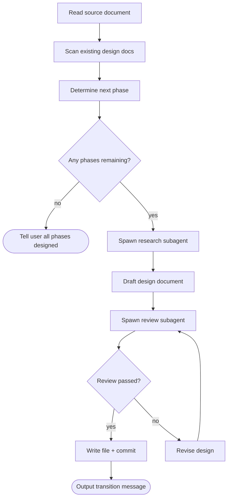

# /chew — Autonomous Phase Design

Accepts a source document (PRD, design doc, or any document with a phased breakdown), determines the logical next phase, and produces one bite-sized design document. Entirely human-free.

## Arguments

`/chew <path-to-source-document>`

## Process



### Step 1: Scan Existing Design Docs

Glob `planning/1. Design/*-design.md` to find all existing design docs. **Read each one** — they are the authoritative source for:
- The established phase roadmap (phase numbers, names, dependencies)
- What has already been designed

### Step 2: Determine Next Phase

**If an existing design doc contains a phase roadmap table** (e.g., "Phase 1 of 8" with a dependency table): use that roadmap as the authoritative phase list. Do NOT re-derive phases from the PRD — the roadmap in the earliest design doc is canonical.

**If no phase roadmap exists in any design doc**, then read the source document and extract:
- The phase list (numbered phases, sections, or stages)
- The dependency graph (which phases depend on which)

Cross-reference the roadmap against existing design docs to identify completed phases. Select the next phase by dependency order: a phase whose dependencies are all already designed. If multiple candidates have no unmet dependencies, prefer the one listed earliest.

If all phases have design docs, tell the user and stop.

### Step 3: Research (Subagent)

Spawn an **Opus subagent** to research the codebase. The subagent prompt must include:
- The phase name and scope from the source document
- The question: "What exists in the codebase that this phase must account for? What are the key files, interfaces, data structures, and integration points?"
- Instruction to return structured findings (not a design — just facts)

Do NOT research inline. The subagent protects the main context window and provides focused results.

### Step 4: Draft Design

Using the research findings AND the source document's requirements for this phase, draft the design document. Follow this template:

```markdown
# Phase N Design: <Phase Name>

**Date:** YYYY-MM-DD
**Source:** `<path-to-source-document>`
**Phase:** N of M
**Complexity:** Low | Low-Medium | Medium
**Depends on:** Phase X (brief description)

---

## Problem
What gap does this phase fill? 2-3 sentences.

## Scope
**In scope:** Bullet list
**Out of scope:** Bullet list (reference later phases by number)

## Design
[Phase-specific technical design. Include data models, decision tables,
file changes, integration points. Be specific enough for a planner to
create implementation tasks.]

## Success Criteria
Numbered list of verifiable outcomes.
```

### Step 5: Review (Subagent)

Spawn an **Opus subagent** to review the draft. The review prompt must include:
- The full draft design
- The source document (or relevant section)
- The question: "Does this design contradict the source document? Are there gaps, missing edge cases, or hidden dependencies? Is it specific enough for an implementation planner to create tasks?"

Apply review feedback and revise if needed. Do NOT present the design to the human.

### Step 6: Write, Commit, Stop

1. **Save** to `planning/1. Design/YYYY-MM-DD_<2-3-word-description>-design.md`
   - Date: today's date, ISO 8601
   - Description: 2-3 hyphenated words summarizing the phase
2. **Commit** the design document
3. **Output exactly this transition message:**

> Design committed. Start a fresh session and run `/writing-plans <design_doc_filepath>` for maximum plan quality.

4. **STOP.** Do not design the next phase. Do not summarize. One phase per invocation.

## Red Flags — STOP

- Re-deriving phases from the PRD when a phase roadmap already exists in a design doc
- Reading the codebase yourself instead of spawning a research subagent
- Presenting the design to the human for approval
- Designing more than one phase
- Continuing after the commit
- Asking the human clarifying questions (use subagents to resolve ambiguity)
