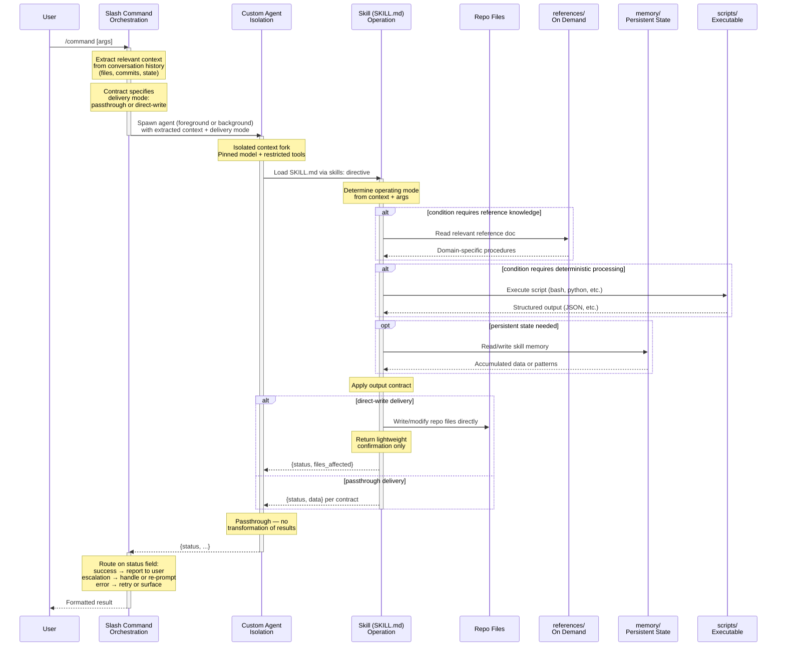
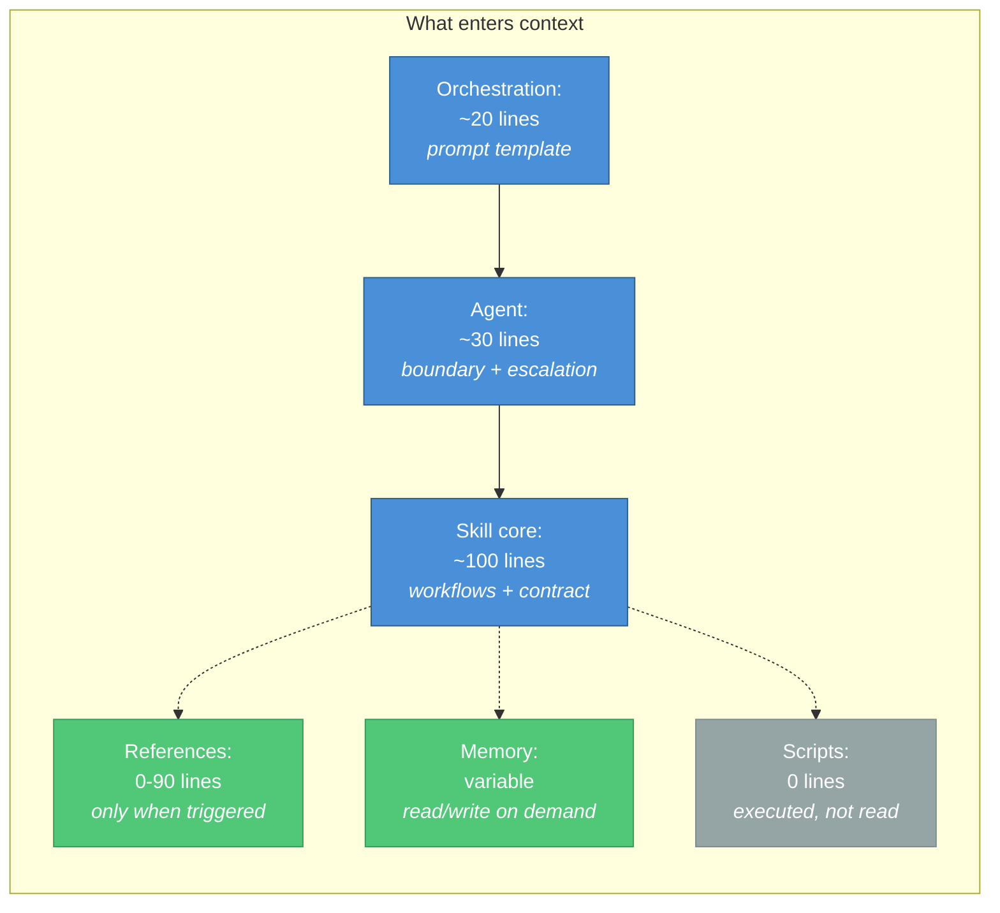

# Three-Layer Agent Architecture

## Overview

| Artifact | Layer | Concerns |
|----------|-------|----------|
| Slash command | **Orchestration** | Context extraction, interface contract (input shape + handshake), agent orchestration (parallel/series), shared context cache, result routing (success/escalation/error) |
| Custom agent | **Isolation** | Execution boundary (isolated context fork), model pin, tool restrictions, escalation protocol, MCP isolation, skill selection |
| Custom skill | **Operation** | Core instructions (SKILL.md -- always loaded), progressive disclosure (references/ -- on demand), executable references (scripts/ -- invoked, never read), skill memory (memory/ -- persistent state), personas + behavior, output contract (result shapes + semantics) |

## Rationale

### Context only where needed

Tokens cost money and superflous tokens degrade performance.  

### Why three layers?

Workflows generally have three distiguishable context layers:  (1) The messy body of all available information; (2) the isolation layer admits necessary tokens and excludes superflous tokens; (3) the operation layer of information relevant to the task at hand.

The orchestration layer has access to the messy body of availablle information, and identifes: (1) what tasks need to done; (2) what information is need to do those tasks; and (3) what tools and skills those tasks require. 

The isolation layer creates an isolated context for tools, instructions and information; admitting what is necessary and filtering out what is superflous. Isolation layers also make parallel and background inference possible.

The operation layer is where intelligence is most valuable. The orchestration layer and isolation layer exist so that the operation layer can be at it's most intelligent by minimizing available context when working on core tasks. 

### Result ownership splits cleanly

The skill defines result semantics (what "success", "escalation", and "error" mean and what data they carry). The agent relays results without transformation. The orchestration layer decides what to *do* with each resulting shape (report to user, escalate, retry, progress to next step). This prevents contention between the agent and skill, and ensures that the layer with the most task-specific knowledge owns result reporting.

### Two result delivery modes

The orchestration layer's contract specifies how results should be delivered:

1. **Passthrough.** The operation layer returns structured data back through the agent and orchestration layer, which formats it for the user. Use when the result is a status, summary, or decision that the user needs to see.
2. **Direct write.** The operation layer writes or modifies files directly in the repo. The return path carries only a lightweight confirmation (e.g., status + file paths affected), not the full content. Use when the result *is* the file change itself — passing large diffs or generated content back through the layers would bloat the context budget without adding value.

The orchestration layer chooses the delivery mode per task. The skill's output contract reflects this: a direct-write contract specifies what files to produce and what confirmation shape to return, while a passthrough contract specifies the full result shape.

### Execution guards — preventing inline bypass

When the system loads a SKILL.md into the main model's context (which happens automatically on `/command` invocation), the main model can read the operation-layer workflow and execute it directly — bypassing the agent spawn entirely. Both layers must carry guards to prevent this:

**Orchestration guard** (`commands/<name>.md`) — place at the top of the agent-spawn section:
> **CRITICAL**: You MUST spawn an Agent to perform this workflow. Do NOT execute the skill inline in the main context, even if SKILL.md content is already loaded. Spawn the agent first — always.

**Operation guard** (`skills/<name>/SKILL.md`) — place immediately after the `# Title` heading:
> **AGENT-ONLY GUARD**: If you are reading this as the main model (not a spawned agent), do NOT execute the workflow below. Return to the orchestration layer and spawn an agent first.

The two guards are bidirectional: the orchestration guard instructs the main model to spawn; the operation guard catches the case where skill content loads before the orchestration instruction fires. Both are required.

### Foreground vs background spawn

The orchestration layer specifies spawn mode in its Agent tool call.

**Default: background.** Use when the operation is self-contained and the conversation can continue before the result arrives — commits, file writes, linting, long-running analysis. The user is not blocked.

**Use foreground only** when the orchestration layer needs the agent's result before it can proceed — e.g., a multi-step workflow where step 2's inputs depend on step 1's output, or when the result must be routed to the user before the session ends.

In the orchestration template, mark the spawn mode explicitly:
- `run_in_background: true` — background (default for self-contained operations)
- `run_in_background: false` (or omit) — foreground (only when result is needed to continue)

### Three skill subfolder categories serve different purposes

Skills typically use three types of conditionally relevant information that is best disclosed progressively:
1. **References.**  Conditional read-only knowledge that enters context only when triggered (submodule handling, complex scenarios). 
2. **Scripts.** Executable utilities that run deterministic algorithims without using valuable context (validators, tools). 
3. **Memory.** A method for persisting output (learned patterns, accumulated data) so that it is available for future sessions..

## Sequence Diagram

## Context Budget

