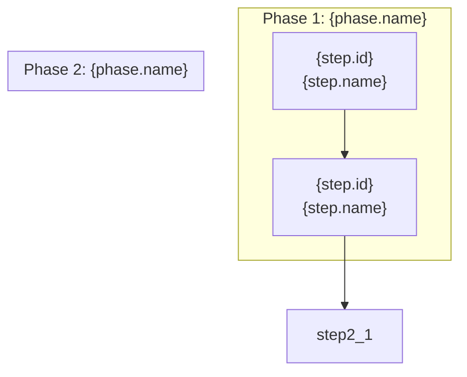
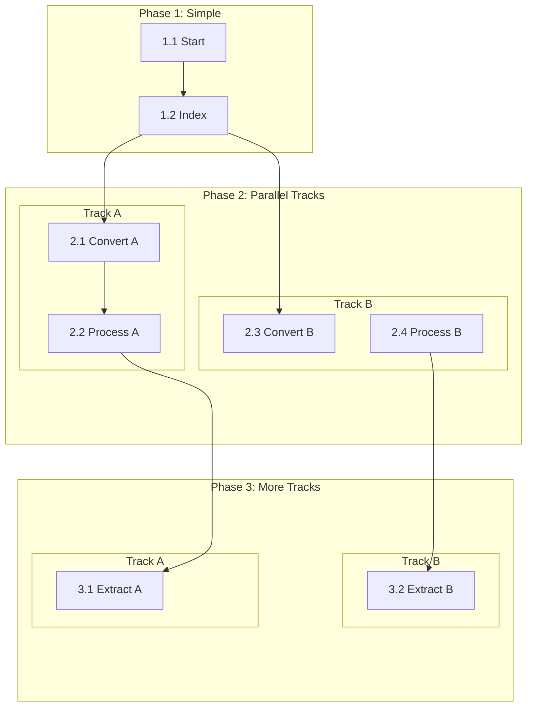

# Mermaid Generation from JSON Diagrams

Generate human-readable Mermaid flowcharts from JSON process diagrams with proper vertical layout.

## When to Generate

Generate/regenerate Mermaid visualization whenever:
- A new JSON diagram is created
- An existing JSON diagram is updated (incremental or full)
- User explicitly requests visualization

## Output Location

**Co-located with JSON source**: Same folder, `.md` extension instead of `.json`.

| JSON Source | Mermaid Output |
|-------------|----------------|
| `diagrams/json/master.json` | `diagrams/json/master.md` |
| `docs/architecture/Draft_NOA_diagram.json` | `docs/architecture/Draft_NOA_diagram.md` |

The Mermaid file is always placed alongside its JSON source for easy navigation.

## Mermaid Structure

### Basic Template



### Node ID Convention

Convert JSON step IDs to Mermaid-safe IDs:
- `step_1.1` → `step1_1`
- `step_2.3` → `step2_3`

Replace dots and underscores for compatibility.

### Node Labels

Include step ID and name for traceability:
```
step1_1["1.1 {step.name}"]
```

For long names, use `<br/>` for line breaks:
```
step1_1["1.1 Extract<br/>Case Files"]
```

## Invisible Anchor Chain Technique

**Problem:** Phases with nested subgraphs (parallel tracks) spread horizontally instead of stacking vertically.

**Solution:** Add invisible anchor nodes and links to create a vertical spine that forces proper layout.

### When to Use Anchors

Add anchor chains when a phase contains:
- 2+ nested subgraphs (parallel tracks)
- 3+ steps that fan out/in across phases

### Anchor Implementation

#### 1. Create Anchor Nodes

Add empty anchor nodes at phase boundaries:
```mermaid
subgraph Phase2["Phase 2: Conversion"]
    subgraph Track2A["Track 2A"]
        step2_1["2.1 Step A"]
        step2_2["2.2 Step B"]
    end
    subgraph Track2B["Track 2B"]
        step2_3["2.3 Step C"]
        step2_4["2.4 Step D"]
    end
    anchor2[ ]
    step2_2 ~~~ anchor2
    step2_4 ~~~ anchor2
end
```

#### 2. Connect Anchors Between Phases

Use `~~~` (invisible link) to chain anchors:
```mermaid
%% Invisible vertical spine
anchor2 ~~~ anchor3_top
anchor3 ~~~ anchor4_top
```

#### 3. Style Anchors as Hidden

Add at end of diagram:
```mermaid
classDef hidden fill:none,stroke:none,color:transparent
class anchor2,anchor3,anchor3_top,anchor4,anchor4_top hidden
```

### Complete Anchor Pattern

For phases with nested subgraphs:



## Mapping JSON to Mermaid

### From `phases` Array

Each phase becomes a subgraph:
```json
{
  "phases": [{
    "id": "phase_1",
    "name": "Source Indexing",
    "steps": [...]
  }]
}
```
→
```mermaid
subgraph Phase1["Phase 1: Source Indexing"]
    %% steps
end
```

### From `steps` Array

Each step becomes a node:
```json
{
  "id": "step_1.1",
  "name": "Create Folder Structure"
}
```
→
```mermaid
step1_1["1.1 Create Folder<br/>Structure"]
```

### From `dependencyGraph.edges`

Each edge becomes a connection:
```json
{
  "edges": [
    {"from": "step_1.1", "to": "step_1.2"},
    {"from": "step_1.2", "to": "step_2.1"}
  ]
}
```
→
```mermaid
step1_1 --> step1_2
step1_2 --> step2_1
```

### From `parallelExecutionGroups`

Parallel groups become nested subgraphs (tracks):
```json
{
  "parallelExecutionGroups": [{
    "groupId": "parallel_1",
    "description": "Conversion tracks",
    "steps": ["step_2.1", "step_2.2", "step_2.3"]
  }]
}
```

Group related steps into Track subgraphs within the phase.

### From `implementationStatus`

Apply styling based on status:
```json
{
  "implementationStatus": {
    "complete": ["step_1.1"],
    "pending": ["step_1.2"],
    "notStarted": ["step_2.1"]
  }
}
```
→
```mermaid
classDef complete fill:#e8f5e9,stroke:#2e7d32
classDef pending fill:#fff3e0,stroke:#ef6c00
classDef notStarted fill:#cfd8dc,stroke:#455a64,stroke-dasharray: 5 5

class step1_1 complete
class step1_2 pending
class step2_1 notStarted
```

## Phase Color Palette

Consistent colors across diagrams:

| Phase | Fill | Stroke |
|-------|------|--------|
| 1 | #e3f2fd | #1565c0 |
| 2 | #e8f5e9 | #2e7d32 |
| 3 | #fff3e0 | #ef6c00 |
| 4 | #fce4ec | #c2185b |
| 5 | #f3e5f5 | #7b1fa2 |
| 6 | #e0f2f1 | #00695c |
| 7 | #fffde7 | #f9a825 |
| 8 | #efebe9 | #4e342e |
| 9 | #e1f5fe | #0277bd |

## Generation Algorithm

1. **Parse JSON** - Load diagram from source JSON file

2. **Identify anchor needs** - For each phase:
   - Count nested subgraphs (parallel groups)
   - If 2+, mark phase for anchors

3. **Generate subgraphs** - For each phase:
   - Create phase subgraph
   - If parallel groups exist, create track subgraphs
   - Add steps as nodes
   - If anchors needed, add bottom anchor

4. **Add anchor spine** - Connect anchors between adjacent anchor-needing phases

5. **Add dependencies** - From `dependencyGraph.edges`

6. **Add styling** - Phase colors, status classes, hidden anchor class

7. **Write output** - Save to same folder as JSON source, with `.md` extension

## Markdown Wrapper

Wrap the Mermaid diagram in a markdown document:

```markdown
# {diagram.title}

{diagram.description}

**Version:** {diagram.version}
**Source:** [{filename}.json](./{filename}.json)
**Generated:** {extractedDate}

## Process Workflow

```mermaid
flowchart TB
    %% Generated diagram here
```

## Phases

{For each phase, add a brief description section}
```
