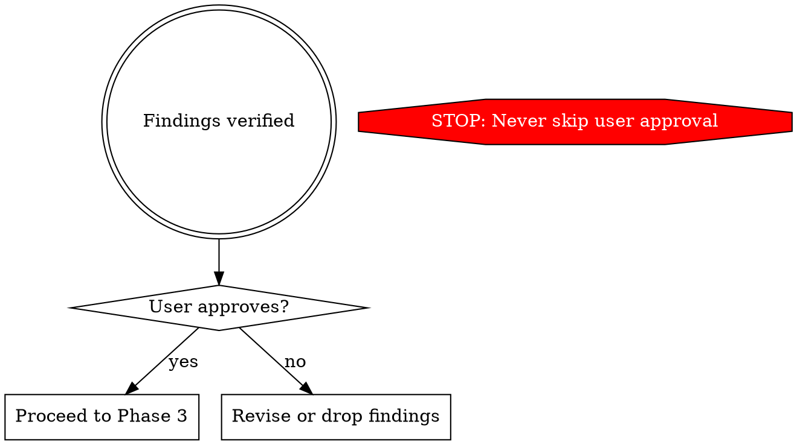

# /standardize — Pattern Standardization

Four-phase pipeline: discover, verify with user, plan sequentially, execute sequentially.

**You are the orchestrator.** You coordinate agents and present findings. You never do discovery or execution yourself.

```
Phase 1: Discovery       1 Opus Explore agent (judgment + ranking)
                                  |
Phase 2: Verification     Main context (Grep/Read + user approval gate)
                                  |
Phase 3: Planning          N Sonnet agents sequentially on main
                           Each invokes: superpowers:writing-plans
                                  |
Phase 4: Execution         N Sonnet agents sequentially on main
                           Each invokes: superpowers:executing-plans
```

## Phase 1: Discovery

Spawn **one Opus Explore agent** (`subagent_type: Explore`, `model: opus`). Prompt must include:

1. Search all composables, stores, views, and services
2. Identify 3-4 categories where the same problem is solved differently
3. For each: every variation with file path, line numbers, code snippet
4. Rank: **best pattern** (with rationale) vs **anti-patterns**
5. Standardize existing patterns — don't invent new ones

**Key instruction:** "Focus on VARIATION — places where different files solve the same problem differently."

**Required output per finding:** good pattern (file, code, why superior), anti-patterns (files, code, what's wrong), impact, exact file list needing changes.

## Phase 2: Verification

**You do this in main context.** Do NOT delegate.

1. Confirm each finding with Grep/Read (count both variants)
2. Validate the "good" pattern is genuinely superior, not just different
3. Drop findings that don't hold up. Finalize 3-4 findings.



**STOP: Present findings to the user** as a summary table. Wait for approval before Phase 3.

## Phase 3: Sequential Planning

Spawn **3-4 Sonnet subagents sequentially** (one per finding). Each works directly on main.

**Agent prompt template:**

```
REQUIRED: Invoke the superpowers:writing-plans skill to create this plan.

## Finding: [Name]

**Best pattern** (already used in [file]):
[code snippet]

**Anti-pattern** (used in [N] files):
[code snippet]

**Files to change:**
- [exact/path/to/file1.js] (lines X-Y)
- ...

**Transformation:** [What to change in each file]

Save plan to: docs/plans/YYYY-MM-DD-standardize-[pattern-name].md
```

Wait for all agents. Collect plan file paths.

## Phase 4: Sequential Execution

Spawn **3-4 Sonnet subagents sequentially** (one per plan). Each works directly on main. Commit after each agent completes before spawning the next.

**Agent prompt template:**

```
REQUIRED: Invoke the superpowers:executing-plans skill.

Plan file: docs/plans/YYYY-MM-DD-standardize-[pattern-name].md

Execute all tasks continuously. Commit after each GREEN phase.
Use conventional commits (e.g., "refactor: standardize X pattern").
```

Wait for all agents.

## Red Flags — STOP

| Thought | Reality |
|---------|---------|
| "I'll discover and fix in one pass" | Discovery and execution are separate phases with a user gate between them |
| "I'll run these in parallel" | Without worktrees, parallel agents create git staging collisions. Sequential execution on main is the safe path. |
| "I can skip user verification" | Phase 2→3 gate exists because discovery agents hallucinate findings |
| "Plans don't need writing-plans format" | Informal plans produce informal execution. Use the skill. |
| "I'll just make the changes directly" | You are the orchestrator. You coordinate agents, not write code. |
| "Only found 1-2 findings, not worth it" | Run with what you have — even 1 finding follows the full pipeline |
| "These findings overlap, combine into one" | Each finding gets its own agent run. Overlapping files are handled sequentially, not a reason to combine. |
