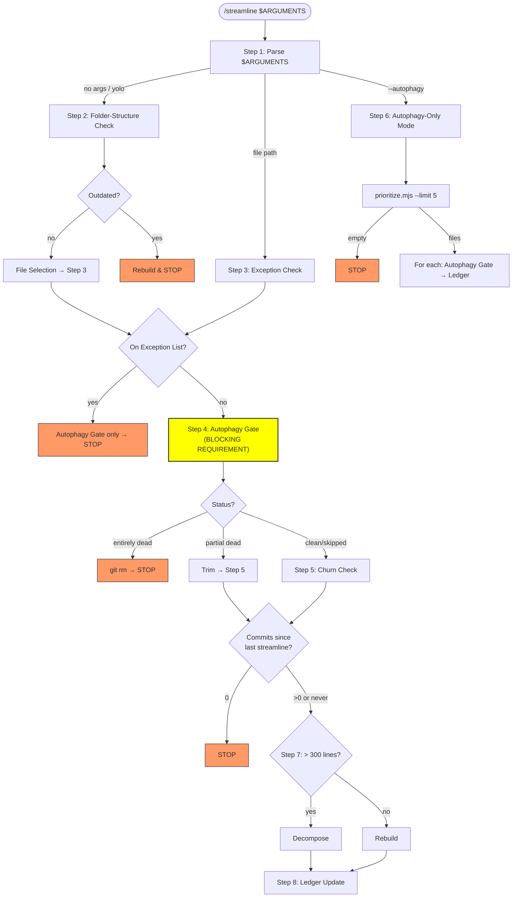

# Streamline Visual Workflow

```mermaid
flowchart TD
    Start(["/streamline $ARGUMENTS"]) --> Parse["Step 1: Parse $ARGUMENTS"]

    Parse -->|"--autophagy"| AutoMode["Step 6: Autophagy-Only Mode"]
    Parse -->|"file path"| DirectMode["Step 3: Exception Check"]
    Parse -->|"no args / yolo"| FullFlow["Step 2: Folder-Structure Check"]

    FullFlow --> DateCheck{"Outdated?"}
    DateCheck -->|yes| Rebuild["Rebuild & STOP"]
    DateCheck -->|no| FileSelect["File Selection → Step 3"]

    FileSelect --> ExCheck{On Exception List?}
    DirectMode --> ExCheck

    ExCheck -->|yes| ExInfo["Autophagy Gate only → STOP"]
    ExCheck -->|no| AG1

    AG1["Step 4: Autophagy Gate\n(BLOCKING REQUIREMENT)"]
    AG1 --> Dead{Status?}
    Dead -->|entirely dead| Delete["git rm → STOP"]
    Dead -->|partial dead| Trim["Trim → Step 5"]
    Dead -->|clean/skipped| Clean["Step 5: Churn Check"]

    Trim --> ChurnCheck
    Clean --> ChurnCheck

    ChurnCheck{"Commits since\nlast streamline?"}
    ChurnCheck -->|"0"| SkipStream["STOP"]
    ChurnCheck -->|">0 or never"| SizeCheck

    SizeCheck{"Step 7: > 300 lines?"}
    SizeCheck -->|yes| Plan["Decompose"]
    SizeCheck -->|no| RebuildFile["Rebuild"]

    Plan --> Ledger["Step 8: Ledger Update"]
    RebuildFile --> Ledger

    AutoMode --> Prioritize["prioritize.mjs --limit 5"]
    Prioritize -->|empty| NoFiles["STOP"]
    Prioritize -->|files| Loop["For each: Autophagy Gate → Ledger"]

    classDef stopNode fill:#f96,stroke:#333
    classDef blockingNode fill:#ff0,stroke:#333,stroke-width:2px
    class Delete,Rebuild,SkipStream,NoFiles,ExInfo stopNode
    class AG1 blockingNode
```
